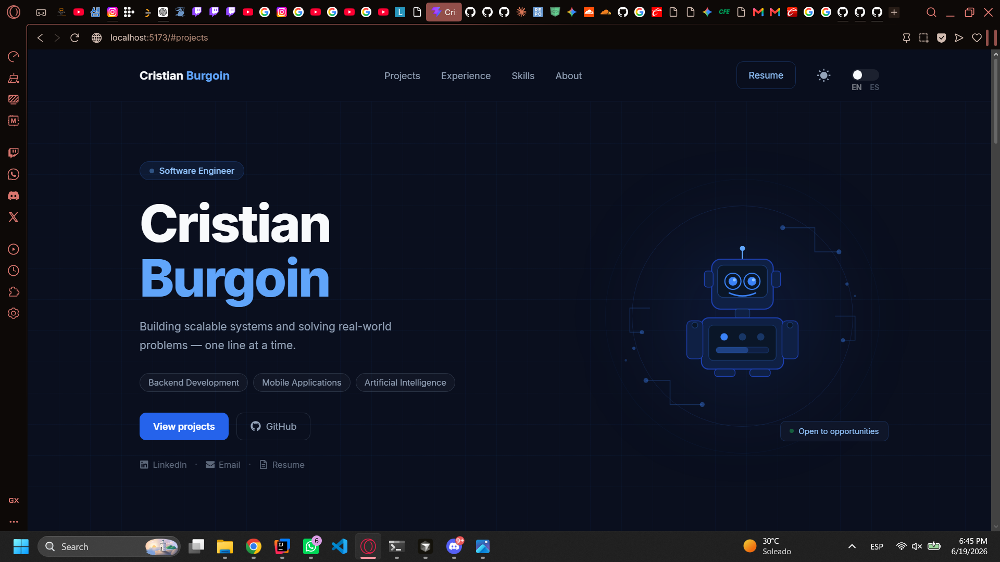
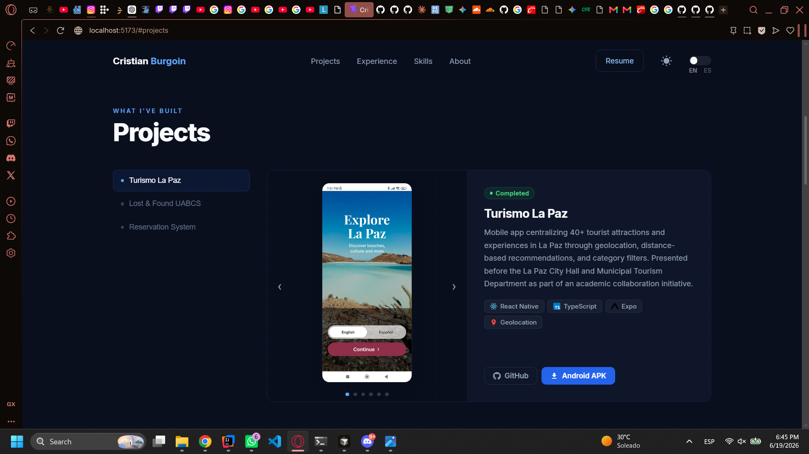
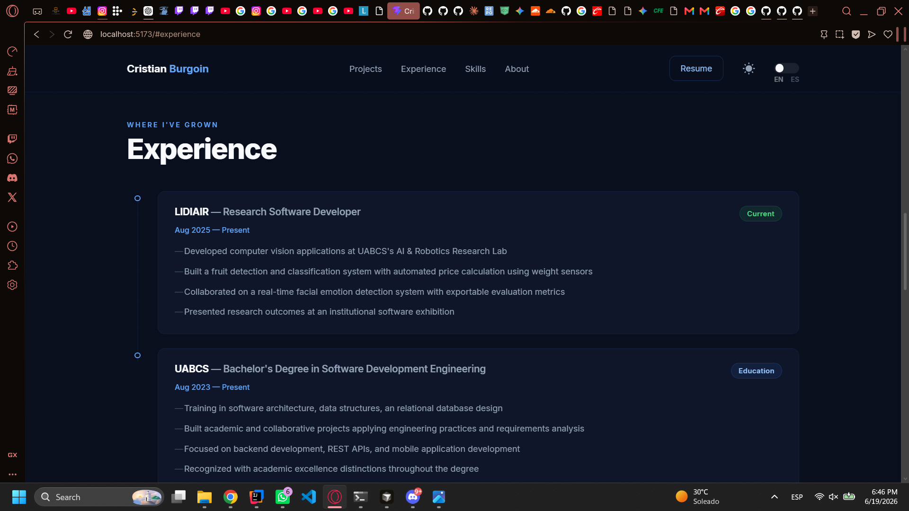
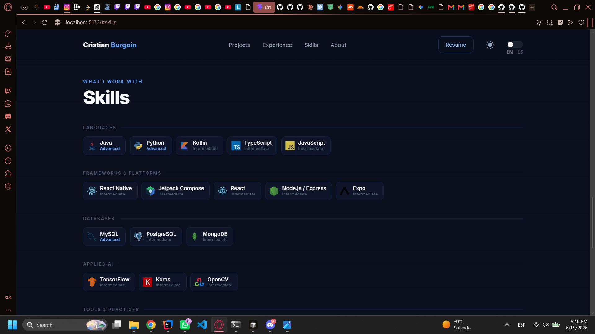
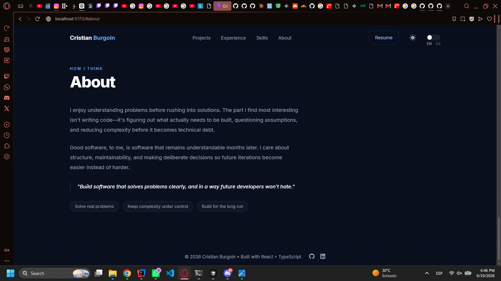

# Portfolio v2

Personal portfolio showcasing software engineering projects focused on mobile development, backend systems, and applied artificial intelligence.

Built with React, TypeScript, and Vite, the portfolio includes multilingual support, dark/light themes, downloadable resumes, and interactive project presentations.

---

## Features

- English and Spanish localization
- Type-safe custom translation system
- Dark and light themes
- Persistent user preferences
- Interactive project showcase
- Mobile application previews
- Backend API visualizations
- APK download integration
- GitHub repository integration
- Responsive design

---

## Screenshots

The screenshots below showcase the main sections of the portfolio.

| Hero | Projects | Experience |
|---|---|---|
|  |  |  |

| Skills | About |
|---|---|
|  |  |

---

## Featured Projects

### 🌊 Turismo La Paz

Mobile application designed to promote tourism in La Paz through geolocation and recommendations.

Technologies:

- React Native
- Expo
- TypeScript

---

### 🔍 Lost & Found UABCS

Academic mobile application for reporting and recovering lost objects within the university community.

Technologies:

- Kotlin
- Jetpack Compose
- Laravel
- Retrofit

---

### 🏨 Hotel Reservation API

Backend REST API focused on reservation management and business rule enforcement.

Technologies:

- Java
- JWT
- MySQL

---

## Tech Stack

### Frontend

- React
- TypeScript
- Vite
- CSS

### State & Architecture

- React Context API
- Local Storage

### Deployment

- GitHub Pages

---

## Running Locally

Requirements:

- Node.js 20+
- npm

Setup:

```bash
git clone https://github.com/cburgoin-dev/portfolio-v2.git

cd portfolio-v2

npm install

npm run dev
```

---

## Purpose

This repository serves as the central hub for presenting my work as a software engineering student and developer.

It showcases projects involving mobile development, backend architecture, and applied AI while emphasizing clean design, accessibility, and maintainability.
